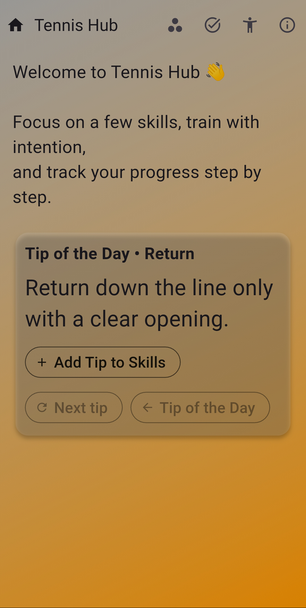
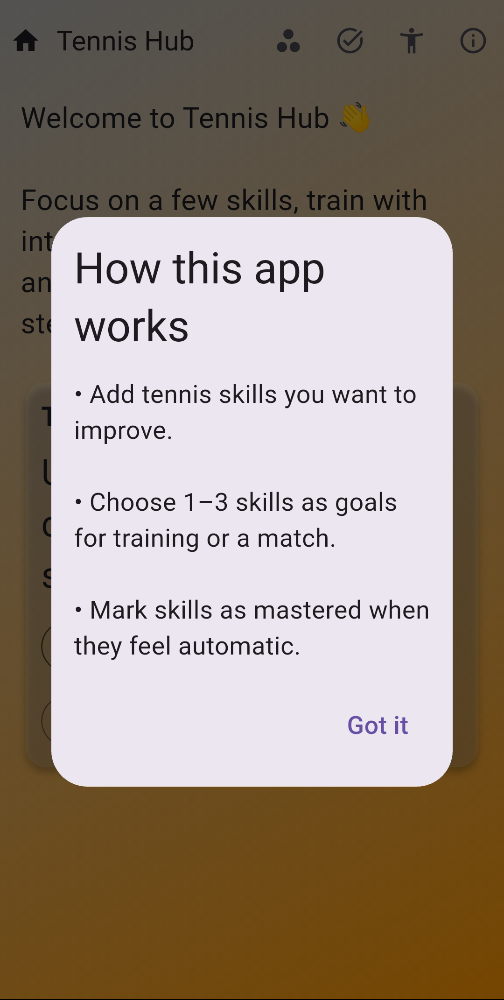
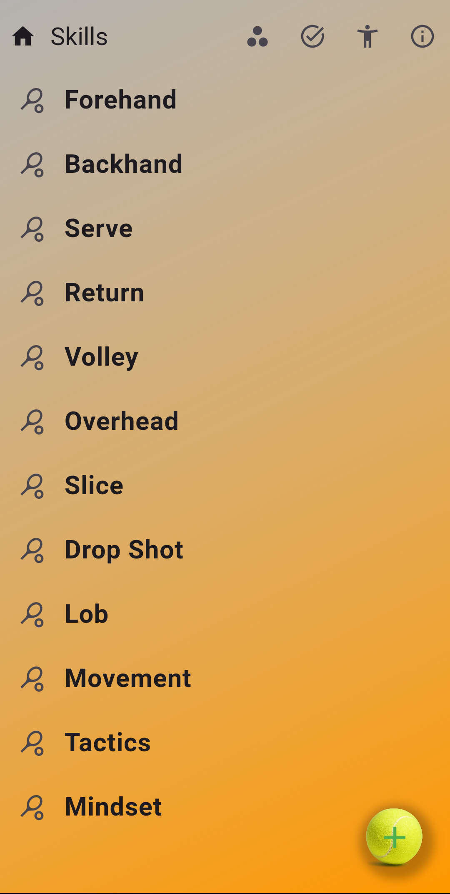
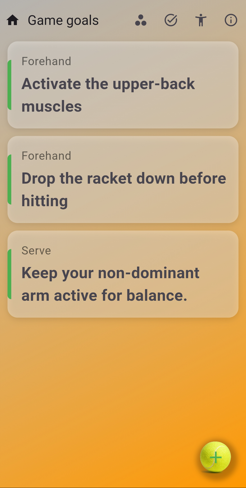
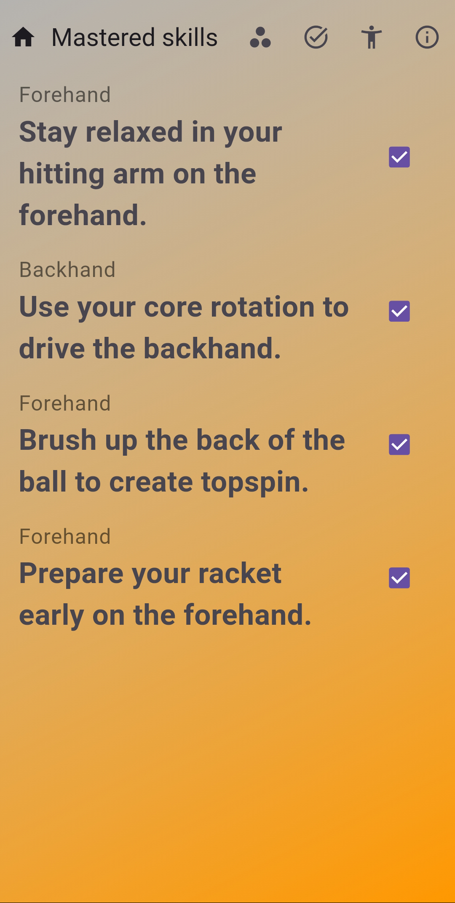

# Tennis Hub 🎾

Tennis Hub is a Flutter mobile app designed to help tennis players
track skill development, manage training goals, and stay motivated
with daily improvement tips.

The app demonstrates a clean Flutter architecture, local persistence,
and scalable state management — suitable for real-world sports and
lifestyle applications.

---

## 📱 App Preview

<!-- Screenshots -->








---


## 🚀 Key Features

- Skills with groups with progress tracking
- Training and match goals
- "Tip of the Day" to encourage consistent improvement
- Local data persistence using SQLite
- Clean separation of UI, state, and data layers

---

## 🧠 Technical Highlights

- Riverpod for predictable and testable state management
- SQLite (sqflite) for offline-first data storage
- Repository pattern for data access abstraction
- Modular and scalable folder structure
- Null-safe Dart codebase

---

## 🛠 Tech Stack

- Flutter (Material 3)
- Riverpod
- SQLite (sqflite)

---

## 🧩 Architecture Overview

```text
lib/
├─ data/
│  └─ random_tennis_tips.dart
│
├─ database/
│  ├─ database.dart
│  └─ db_constants.dart
│
├─ providers/
│  ├─ database_provider.dart
│  ├─ goals_providers.dart
│  ├─ mastered_screens_providers.dart
│  ├─ providers.dart
│  ├─ skill_areas_providers.dart
│  ├─ skills_providers.dart
│  └─ tips_providers.dart
│
├─ screens/
│  ├─ goals_screen.dart
│  ├─ home_content_screen.dart
│  ├─ home_page.dart
│  ├─ mastered_skills_screen.dart
│  ├─ screen_data.dart
│  ├─ skill_areas_screen.dart
│  └─ skills_screen.dart
│
├─ utils/
│  ├─ add_edit_goal_dialog.dart
│  ├─ edit_item_dialog.dart
│  ├─ gradient_background.dart
│  └─ show_context_menu.dart
│
├─ widgets/
│  ├─ help_dialog.dart
│  └─ tennis_ball_button.dart
│
└─ main.dart
